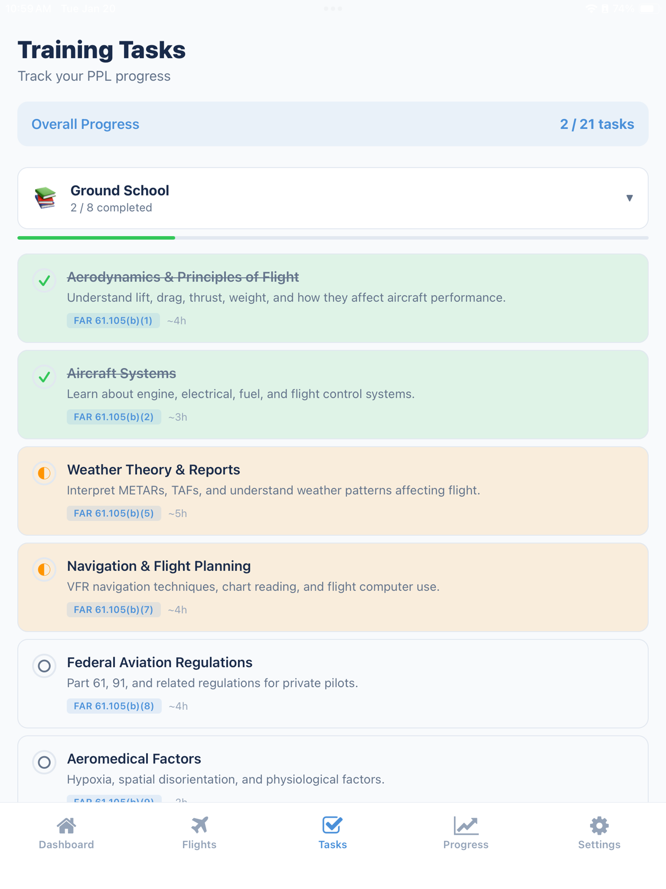
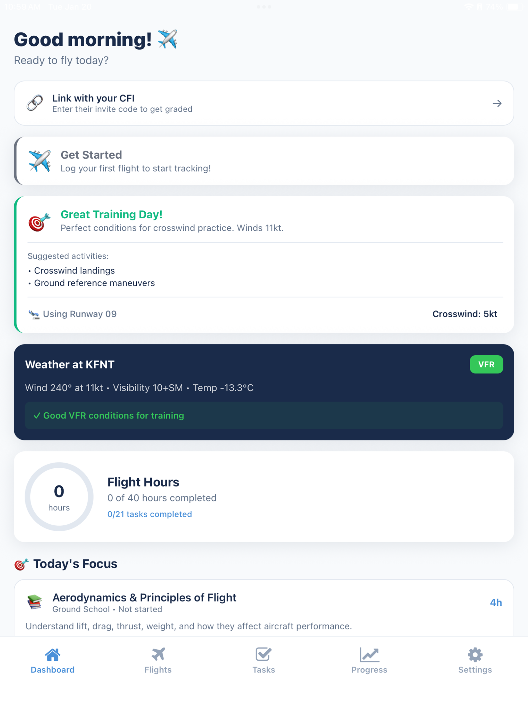
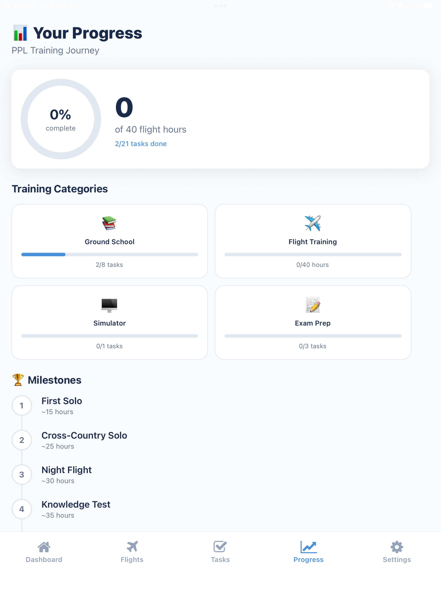

# ✈️ SkyLaunch
**The Open Source Flight Training Progression Engine**

<p align="center">
  
  
  
  
  
</p>

> **"Part 61 flexibility meets Part 141 structure."**

SkyLaunch is an offline-first mobile application that acts as a **state manager for student pilot proficiency.** It decouples training data from paper logbooks, allowing students to visualize their progression against FAA Airman Certification Standards (ACS) in real-time.

Designed for the React Native ecosystem, it solves the specific data fragmentation issues found in general aviation flight training.

---

## 📸 Interface
| Syllabus Tracker | Weather Intelligence | Progress Rings |
|:---:|:---:|:---:|
|  |  |  |

---

## 🧠 The Engineering Challenge (Why this exists)

Flight training in the US operates under two regulations: Part 141 (Rigid/School-based) and Part 61 (Flexible/Freelance). While Part 61 offers flexibility, it suffers from **systemic data fragmentation**:

1.  **State Management Failure:** When a student changes instructors, their "training state" (proficiency in specific maneuvers) is lost or relies on subjective paper notes.
2.  **Lack of Deterministic Scheduling:** Go/No-Go decisions are often made based on "gut feeling" at the hangar. SkyLaunch shifts this decision to the **Pre-flight Briefing** phase, using live data to prevent wasted trips to the airport.
3.  **Linear Logging vs. Non-Linear Learning:** Traditional logbooks track *time* (linear), but flight proficiency is *asymptotic*. Existing tools fail to visualize this difference.

**SkyLaunch solves this by treating the FAA ACS as a data schema, linking individual flight telemetry to certification milestones.**

---

## ✨ Core Architecture & Features

### ⚙️ Deterministic Scheduling Engine
Unlike standard calendar apps, SkyLaunch uses a "Constraint-Based" scheduling logic:
* **VFR-Lock:** Integrates real-time METAR data to flag slots as "No-Go" if ceiling/visibility drops below student minimums.
* **Curriculum Prioritization:** Automatically suggests the next maneuver based on the "decay rate" of previously learned skills.

### 🔄 Real-Time "Digital Chain of Custody"
Designed to bridge the gap between the Student (at home) and the CFI (at the flight school).
* **Instant Sync:** Leverages Supabase real-time subscriptions to ensure that when a student logs a flight, the CFI's dashboard updates immediately for grading.
* **Briefing/Debriefing Mode:** Optimized for the "ground school" workflow, allowing instructors to review flight metrics and sign digital endorsements without passing a physical logbook back and forth.

### 📊 The "Proficiency Graph"
* **Visualizing Competence:** Replaces the paper logbook with dynamic "Progress Rings."
* **Pace Algorithms:** Calculates Estimated Time of Arrival (ETA) for checkride readiness based on current flight frequency and skill acquisition velocity.

---

## 🛠️ Tech Stack

| Layer | Technology | Decision Rationale |
|-------|------------|-------------------|
| **Framework** | Expo (React Native) | Single codebase for iOS/Android; OTA update capability. |
| **State** | Zustand | Lightweight state management for complex briefing forms. |
| **Backend** | Supabase | Postgres RLS for privacy; Realtime subscriptions for student-CFI sync. |
| **API** | NOAA/AWC | Direct integration for live METAR/TAF data. |
| **Testing** | Jest + ts-jest | Ensures reliability of pace calculation algorithms. |
---

## 🚀 Getting Started

### Prerequisites
* Node.js 18+
* Expo CLI
* Supabase Account (Free Tier works)

### Installation

1.  **Clone the repository**
    ```bash
    git clone https://github.com/unshah/SkyLaunch.io.git
    cd SkyLaunch.io/app-src
    ```

2.  **Install dependencies**
    ```bash
    npm install
    ```

3.  **Environment Setup**
    Create a `.env` file:
    ```env
    EXPO_PUBLIC_SUPABASE_URL=your_url
    EXPO_PUBLIC_SUPABASE_ANON_KEY=your_key
    EXPO_PUBLIC_AIRPORT_DB_TOKEN=your_token
    ```

4.  **Database Migration**
    Run the following SQL schemas (located in project root) via the Supabase Dashboard SQL Editor:
    - `supabase_schema.sql` — Core tables
    - `supabase_schema_cfi.sql` — CFI-specific tables
    - `supabase_schema_scheduling.sql` — Scheduling tables

5.  **Lift off**
    ```bash
    npx expo start
    ```

---

## 🤝 Project Stewardship

This project is architected and maintained by **[Ujjwal Shah](https://ushah.me)**.

SkyLaunch is an open effort to modernize general aviation software. We strictly adhere to "Clean Architecture" principles to ensure the codebase remains accessible to developer-pilots who wish to contribute.

## 🤝 Contributing & Community

SkyLaunch is an open-source project, and we welcome contributions from the aviation and developer communities.

**How to get involved:**
* **Feature Requests:** Have an idea for a better "Syllabus View" or a specific metric you want to track? Open an Issue on GitHub.
* **Bug Reports:** If you notice a calculation error in the scheduling engine, please report it.
* **Pull Requests:** We are open to PRs! Please check the `Help Wanted` tag for tasks related to **Unit Testing** and **Documentation** before diving into core logic.

*Note: Please read `CONTRIBUTING.md` before submitting code.*

---

## 📄 License
MIT License - Free for all Part 61 and Part 141 students forever.

<p align="center">
  <strong>Fly Safe. Fly Smart.</strong>
</p>